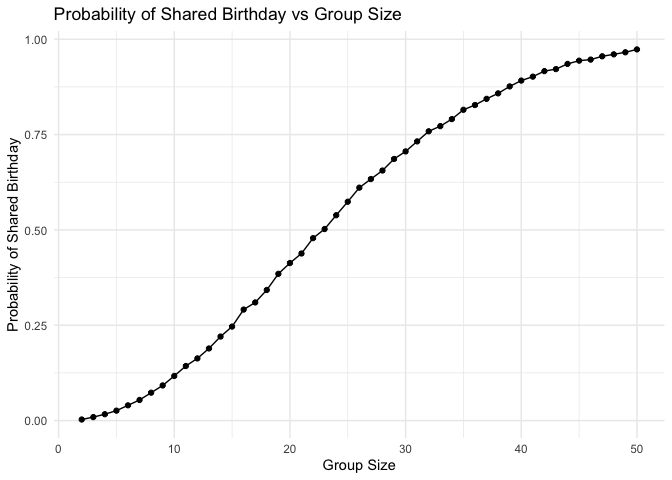
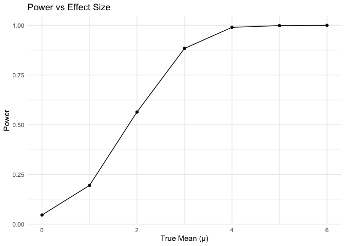
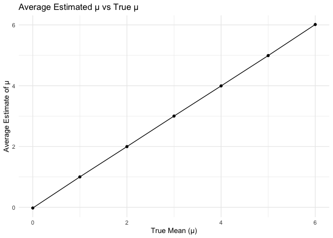
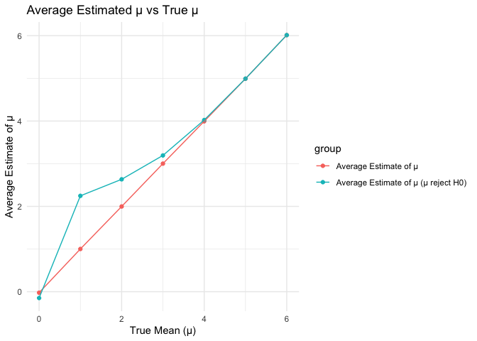

p8105_hw5_jc6422
================
Jianing Chen
2024-11-05

## Question 1

Write a function

``` r
shared_birthday = function(n) {
  birthdays = sample(1:365, n, replace = TRUE)
  return(any(duplicated(birthdays)))
}
```

Run this function 10000 times for each group size between 2 and 50.

``` r
group_sizes = 2:50
simulations = 10000

results = 
  tibble(group_size = group_sizes) %>%
  mutate(
    output_lists = map(group_size, ~rerun(simulations, shared_birthday(.x))),
    estimate_df = map(output_lists, ~tibble(shared_birthday = unlist(.)))
     )%>%
  select(-output_lists) %>%
  unnest(estimate_df) %>%
  group_by(group_size) %>%
  summarize(probability = mean(shared_birthday), .groups = 'drop')

results
```

    ## # A tibble: 49 × 2
    ##    group_size probability
    ##         <int>       <dbl>
    ##  1          2      0.0028
    ##  2          3      0.0077
    ##  3          4      0.0178
    ##  4          5      0.027 
    ##  5          6      0.0395
    ##  6          7      0.058 
    ##  7          8      0.0746
    ##  8          9      0.0894
    ##  9         10      0.121 
    ## 10         11      0.146 
    ## # ℹ 39 more rows

Make a plot showing the probability as a function of group size.

``` r
results %>%
  ggplot(aes(x = group_size, y = probability)) +
  geom_line() +
  geom_point() +
  labs(title = "Probability of Shared Birthday vs Group Size",
       x = "Group Size",
       y = "Probability of Shared Birthday") +
  theme_minimal()
```

<!-- -->

This plot shows the relationship between the probability of shared
birthday and group size, as the group size increases, the probability of
at least two people sharing a birthday rises rapidly. This growth is
nonlinear. The probability increasing quickly at first and flattening as
it approaches 1 according to the group size approaches to 50.

## Question 2

Define a function to obtain the estimate and p-value

``` r
n = 30         
sigma = 5  
times = 5000 
get_estimate_pvalue = function(mu) {
  estimate = numeric(times)
  pvalue = numeric(times)
  for(i in 1:times) {
    x = rnorm(n, mu, sigma)
    t_test_result = broom::tidy(t.test(x, mu = 0, alternative = "two.sided"))
    estimate[i] = as.numeric(t_test_result$estimate)
    pvalue[i] = as.numeric(t_test_result$p.value)
  }
  result = data.frame(
    mu = rep(mu, times),
    estimate = estimate,
    pvalue = pvalue
  )
  return(result)
}

# get the estimate and p-value with different mu
result = get_estimate_pvalue(mu = 0)
for(i in 1:6){
  result = rbind(result, get_estimate_pvalue(mu = i))
}
```

Calculate the proportion of times the null was rejected.

``` r
df1 = result %>%
  group_by(mu) %>%
  summarise(proportion = mean(pvalue < 0.05))
```

Make a plot showing the relationship between effect size and power of
the test.

``` r
ggplot(df1, aes(x = mu, y = proportion)) +
  geom_point() +
  geom_line() +
  labs(x = "True Mean (μ)", y = "Power") +
  ggtitle("Power vs Effect Size") +
  theme_minimal()
```

<!-- -->

From this figure, we can observe that the larger the effect size, the
higher the power.

Calculate the average estimate of μ

``` r
df2 = result %>%
  group_by(mu) %>%
  summarise(estimate = mean(estimate))
```

Make a plot showing the average estimate of μ and true μ

``` r
ggplot(df2, aes(x = mu, y = estimate)) +
  geom_point() +
  geom_line() +
  labs(x = "True Mean (μ)", y = "Average Estimate of μ") +
  ggtitle("Average Estimated μ vs True μ") +
  theme_minimal()
```

<!-- -->
Calculate the average estimate of μ only in samples for which the null
was rejected.

``` r
df3 = result %>%
  filter(pvalue < 0.05) %>%
  group_by(mu) %>%
  summarise(estimate = mean(estimate))
```

Make a plot overlay on the first plot

``` r
df = rbind(df2, df3)
df$group = c(rep("Average Estimate of μ", 7), rep("Average Estimate of μ (μ reject H0)", 7))

ggplot(df, aes(x = mu, y = estimate, color = group, group = group)) +
  geom_point() +
  geom_line() +
  labs(x = "True Mean (μ)", y = "Average Estimate of μ") +
  ggtitle("Average Estimated μ vs True μ") +
  theme_minimal()
```

<!-- -->

From this figure, we can see that the the sample average of μ across
tests for which the null is rejected approximately is not equal to the
true value of μ. Because only those samples with large effects are more
likely to be rejected, the average of these samples with large effects
will be larger than the true value.
