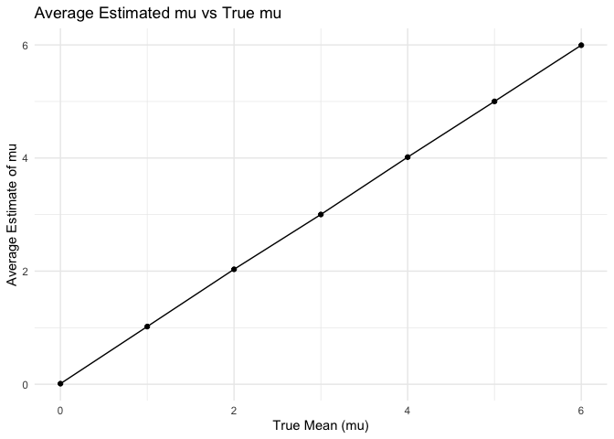
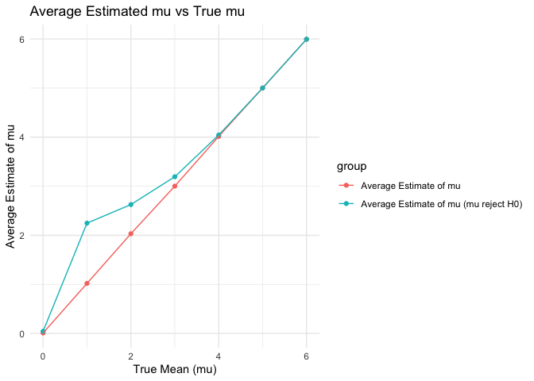
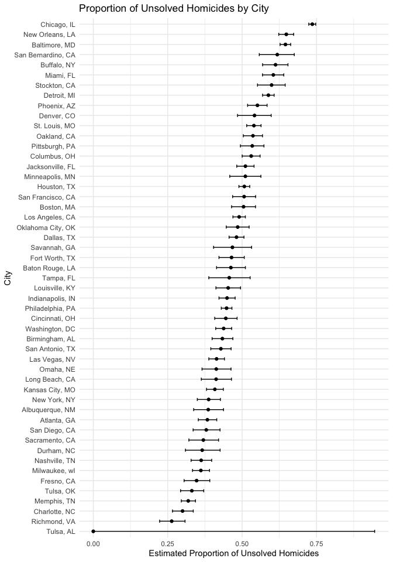

p8105_hw5_jc6422
================
Jianing Chen
2024-11-05

## Question 1

Write a function

``` r
shared_birthday = function(n) {
  birthdays = sample(1:365, n, replace = TRUE)
  return(any(duplicated(birthdays)))
}
```

Run this function 10000 times for each group size between 2 and 50.

``` r
group_sizes = 2:50
simulations = 10000

results = 
  tibble(group_size = group_sizes) %>%
  mutate(
    output_lists = map(group_size, ~rerun(simulations, shared_birthday(.x))),
    estimate_df = map(output_lists, ~tibble(shared_birthday = unlist(.)))
     )%>%
  select(-output_lists) %>%
  unnest(estimate_df) %>%
  group_by(group_size) %>%
  summarize(probability = mean(shared_birthday), .groups = 'drop')

results
```

    ## # A tibble: 49 × 2
    ##    group_size probability
    ##         <int>       <dbl>
    ##  1          2      0.0026
    ##  2          3      0.0083
    ##  3          4      0.0168
    ##  4          5      0.0281
    ##  5          6      0.0402
    ##  6          7      0.0537
    ##  7          8      0.0725
    ##  8          9      0.0978
    ##  9         10      0.118 
    ## 10         11      0.141 
    ## # ℹ 39 more rows

Make a plot showing the probability as a function of group size.

``` r
results %>%
  ggplot(aes(x = group_size, y = probability)) +
  geom_line() +
  geom_point() +
  labs(title = "Probability of Shared Birthday vs Group Size",
       x = "Group Size",
       y = "Probability of Shared Birthday") +
  theme_minimal()
```

<!-- -->

This plot shows the relationship between the probability of shared
birthday and group size, as the group size increases, the probability of
at least two people sharing a birthday rises rapidly. This growth is
nonlinear. The probability increasing quickly at first and flattening as
it approaches 1 according to the group size approaches to 50.

## Question 2

Define a function to obtain the estimate and p-value

``` r
n = 30         
sigma = 5  
times = 5000 
get_estimate_pvalue = function(mu) {
  estimate = numeric(times)
  pvalue = numeric(times)
  for(i in 1:times) {
    x = rnorm(n, mu, sigma)
    t_test_result = broom::tidy(t.test(x, mu = 0, alternative = "two.sided"))
    estimate[i] = as.numeric(t_test_result$estimate)
    pvalue[i] = as.numeric(t_test_result$p.value)
  }
  result = data.frame(
    mu = rep(mu, times),
    estimate = estimate,
    pvalue = pvalue
  )
  return(result)
}

# get the estimate and p-value with different mu
result = get_estimate_pvalue(mu = 0)
for(i in 1:6){
  result = rbind(result, get_estimate_pvalue(mu = i))
}
```

Calculate the proportion of times the null was rejected.

``` r
df1 = result %>%
  group_by(mu) %>%
  summarise(proportion = mean(pvalue < 0.05))
```

Make a plot showing the relationship between effect size and power of
the test.

``` r
ggplot(df1, aes(x = mu, y = proportion)) +
  geom_point() +
  geom_line() +
  labs(x = "True Mean (mu)", y = "Power") +
  ggtitle("Power vs Effect Size") +
  theme_minimal()
```

<!-- -->

From this figure, we can observe that the larger the effect size, the
higher the power.

Calculate the average estimate of mu

``` r
df2 = result %>%
  group_by(mu) %>%
  summarise(estimate = mean(estimate))
```

Make a plot showing the average estimate of mu and true mu

``` r
ggplot(df2, aes(x = mu, y = estimate)) +
  geom_point() +
  geom_line() +
  labs(x = "True Mean (mu)", y = "Average Estimate of mu") +
  ggtitle("Average Estimated mu vs True mu") +
  theme_minimal()
```

<!-- -->
Calculate the average estimate of mu only in samples for which the null
was rejected.

``` r
df3 = result %>%
  filter(pvalue < 0.05) %>%
  group_by(mu) %>%
  summarise(estimate = mean(estimate))
```

Make a plot overlay on the first plot

``` r
df = rbind(df2, df3)
df$group = c(rep("Average Estimate of mu", 7), rep("Average Estimate of mu (mu reject H0)", 7))

ggplot(df, aes(x = mu, y = estimate, color = group, group = group)) +
  geom_point() +
  geom_line() +
  labs(x = "True Mean (mu)", y = "Average Estimate of mu") +
  ggtitle("Average Estimated mu vs True mu") +
  theme_minimal()
```

<!-- -->

From this figure, we can see that the the sample average of mu across
tests for which the null is rejected approximately is not equal to the
true value of mu. Because only those samples with large effects are more
likely to be rejected, the average of these samples with large effects
will be larger than the true value.

## Question 3

Load the data

``` r
data = read_csv("homicide-data.csv")
```

In this dataset, there are 50 unique cities. There are
52179observations. There are 12 variables. The variables are uid,
reported_date, victim_last, victim_first, victim_race, victim_age,
victim_sex, city, state, lat, lon, disposition

Create a `city_state` variable and then summarize within cities.

``` r
summary = data %>%
  mutate(city_state = str_c(city, ", ", state)) %>%
  group_by(city_state) %>%
  summarize(
    total_homicides = n(),
    unsolved_homicides = sum(disposition %in% c("Closed without arrest", "Open/No arrest"))
  )
summary
```

    ## # A tibble: 51 × 3
    ##    city_state      total_homicides unsolved_homicides
    ##    <chr>                     <int>              <int>
    ##  1 Albuquerque, NM             378                146
    ##  2 Atlanta, GA                 973                373
    ##  3 Baltimore, MD              2827               1825
    ##  4 Baton Rouge, LA             424                196
    ##  5 Birmingham, AL              800                347
    ##  6 Boston, MA                  614                310
    ##  7 Buffalo, NY                 521                319
    ##  8 Charlotte, NC               687                206
    ##  9 Chicago, IL                5535               4073
    ## 10 Cincinnati, OH              694                309
    ## # ℹ 41 more rows

For the city of Baltimore, MD, use `pop.test` function to estimate the
proportion of homicides that are unsolved.

``` r
baltimore_data = summary %>% 
  filter(city_state == "Baltimore, MD") 
  
baltimore_test = prop.test(baltimore_data$unsolved_homicides, baltimore_data$total_homicides)
baltimore_test
```

    ## 
    ##  1-sample proportions test with continuity correction
    ## 
    ## data:  baltimore_data$unsolved_homicides out of baltimore_data$total_homicides, null probability 0.5
    ## X-squared = 239.01, df = 1, p-value < 2.2e-16
    ## alternative hypothesis: true p is not equal to 0.5
    ## 95 percent confidence interval:
    ##  0.6275625 0.6631599
    ## sample estimates:
    ##         p 
    ## 0.6455607

Apply `broom::tidy` to this project and pull the estimated proportion
and confidence intervals.

``` r
baltimore_result = broom::tidy(baltimore_test)

estimate_prop = baltimore_result$estimate
estimate_prop
```

    ##         p 
    ## 0.6455607

``` r
conf_low = baltimore_result$conf.low
conf_low
```

    ## [1] 0.6275625

``` r
conf_high = baltimore_result$conf.high
conf_high
```

    ## [1] 0.6631599

Run `prop.test` for each of the cities in the dataset, and create a tidy
dataframe with estimated proportions and CIs for each city.

``` r
city = summary %>%
  mutate(
    test_result = purrr::map2(unsolved_homicides, total_homicides, ~ prop.test(.x, .y)),
    tidy_result = purrr::map(test_result, broom::tidy)
  ) %>%
  unnest(tidy_result) %>%
  select(city_state, estimate, conf.low, conf.high)

city
```

    ## # A tibble: 51 × 4
    ##    city_state      estimate conf.low conf.high
    ##    <chr>              <dbl>    <dbl>     <dbl>
    ##  1 Albuquerque, NM    0.386    0.337     0.438
    ##  2 Atlanta, GA        0.383    0.353     0.415
    ##  3 Baltimore, MD      0.646    0.628     0.663
    ##  4 Baton Rouge, LA    0.462    0.414     0.511
    ##  5 Birmingham, AL     0.434    0.399     0.469
    ##  6 Boston, MA         0.505    0.465     0.545
    ##  7 Buffalo, NY        0.612    0.569     0.654
    ##  8 Charlotte, NC      0.300    0.266     0.336
    ##  9 Chicago, IL        0.736    0.724     0.747
    ## 10 Cincinnati, OH     0.445    0.408     0.483
    ## # ℹ 41 more rows

Create a plot that shows the estimates and CIs for each city.

``` r
ggplot(city, aes(x = reorder(city_state,estimate), y = estimate)) +
  geom_point() +
  geom_errorbar(aes(ymin = conf.low, ymax = conf.high), width = 0.3) +
  coord_flip() +
  labs(
    title = "Proportion of Unsolved Homicides by City",
    x = "City",
    y = "Estimated Proportion of Unsolved Homicides"
  ) +
  theme_minimal()
```

<!-- -->

This plot shows the proportion of unsolved homicides for various U.S.
cities. Chicago, IL, have the highest proportions of unsolved homicides,
with estimates close to 0.75. Tulsa, AL, have the lowest unsolved
homicide rates, with estimates close to 0. Error bars show the 95%
confidence interval for each estimate. Chicago, IL tend to have narrower
intervals, suggesting that these estimates are reliable. Tulsa, AL, has
a wider confidence interval, which suggests a greater uncertainty.
